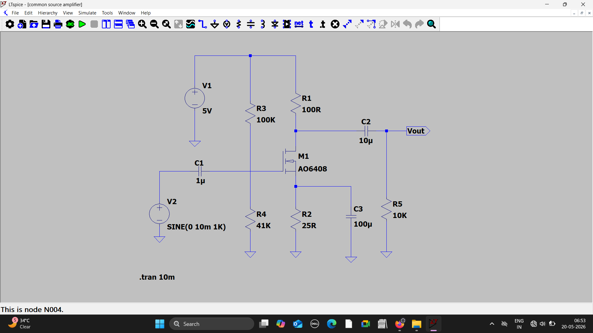

# Common Source MOS Amplifier using LTspice

## Objective
Designed and stimulated a MOSFET common source amplifier using LTspice to analyse voltage amplification behavior.

## Concepts used
- MOSFET Amplification
- Analog CMOS fundamentals
- Voltage gain  

  

## Circuit Schematic 

## Output Waveforms

## Results
Observed amplified output signal with phase inversion characteristic of common source amplifier.

## Tools used

- LTspice
